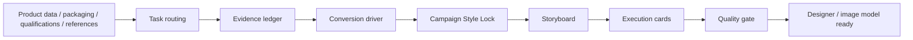

<div align="center">

# 🛒 E-commerce Visual Copywriting

### Main Images · PDP / Detail Page · Amazon Listing / A+ · On-image Copy · Image Prompts · Compliance Review

**Turn fragmented product inputs into an execution-ready e-commerce visual system for designers and AI image models.**

[](SKILL.md)
[](SKILL.md)
[](https://skills.sh/feichanggege/ecommerce-visual-copywriting-skill)
[](LICENSE)
[](tools/verify-skill.py)

[中文](README.md) · **English**

[Quick Start](#-quick-start) · [Why It Exists](#-why-it-exists) · [Workflow](#-workflow) · [Platforms](#-platforms) · [Showcase](#-showcase) · [Safety](#-safety)

</div>

<p align="center">
  
</p>

> This is not another generic ad-copy prompt. It first decides **why the customer should buy**, locks **visual consistency and product fidelity**, builds an **evidence ledger**, then outputs execution-ready scenes, copy, design notes, prompts, and negative constraints.

---

## ✨ Why It Exists

| Common failure | How this Skill handles it |
|---|---|
| Five images repeat the same selling point | Each image solves one purchase-decision question |
| Specifications are copied without meaning | `Feature → Advantage → Benefit → Evidence` |
| Reference images drift away from the real product | Reference Fidelity locks packaging, logo, structure, and specs |
| Aggressive copy creates unsupported claims | Evidence ledger before final claims |
| Existing pages get rebuilt from scratch | Audit/revision mode makes the minimum necessary changes |
| Cross-border pages are literal translations | Localizes reasoning, units, scenarios, and information density |
| Old platform knowledge is stated as current policy | Current rules are verified from official sources when needed |
| Copy is not usable by a designer | Each image includes scene, copy, rationale, prompt, negative prompt, and evidence notes |

---

## 🚀 Quick Start

```bash
npx skills add feichanggege/ecommerce-visual-copywriting-skill
```

Then ask:

```text
Here are the product materials, packaging images, and reference images.
For Amazon US, create 7 listing images plus an A+ visual plan in one pass.
For each image include the scene, English on-image copy, design rationale,
image-generation prompt, negative prompt, and evidence notes.
Do not invent missing facts; label assumptions explicitly.
```

Or simply:

```text
Turn this product into an execution-ready main-image and PDP plan for my designer.
```

---

## 🧭 Workflow



### Four execution modes

| Mode | Use when | Behavior |
|---|---|---|
| **Standard** | Direction is unclear or review gates matter | Strategy → storyboard → confirmation → execution |
| **One-shot** | Inputs are clear or user asks for full delivery | Completes the workflow without unnecessary pauses |
| **Audit / revision** | Existing images, copy, prompts, or PDP | Finds problems and applies minimum necessary changes |
| **Designer handoff** | Production needs a structured brief | Outputs consistent image/module execution cards |

### What v3 adds

- **Evidence Ledger** — classifies claims as Verified / Supported / Needs proof / Disallowed.
- **Reference Fidelity** — defines what must stay and what may change.
- **Negative Constraints** — blocks packaging drift, logo changes, wrong specs, text artifacts, anatomy errors, etc.
- **Dynamic image count** — five is a default, not a hard rule.
- **Multi-platform playbooks** — China e-commerce + Amazon / Shopify / TikTok Shop / Temu / Shopee / Lazada.
- **Cross-border localization** — rewrites purchase reasoning instead of literal translation.
- **Hard blockers + Pass/Fail gates** — replaces arbitrary 80/100 scoring.

---

## 📦 Deliverables

The Skill can produce:

- Conversion driver + top three purchase reasons
- Evidence ledger
- `Feature → Advantage → Benefit → Evidence`
- Campaign Style Lock
- Main-image / PDP / Listing / A+ storyboard
- Scene and composition descriptions
- On-image copy
- Design rationale
- Image-generation prompts
- Negative prompts / forbidden changes
- Evidence and compliance notes
- Audit/revision reports
- Cross-border localization

A typical image set may use roles such as:

```text
Hero      → identify the product + one primary reason to click
Benefit   → translate a feature into customer value
Proof     → build trust with real evidence
Scene     → create usage relevance
Spec/CTA  → reduce selection friction
```

The actual count depends on the platform and product.

---

## 🌍 Platforms

| China | Cross-border / DTC |
|---|---|
| Taobao / Tmall | Amazon Listing / A+ / Brand Story |
| JD | Shopify / DTC PDP |
| Pinduoduo | TikTok Shop |
| Douyin Shop | Temu |
| Other PDP scenarios | Shopee / Lazada |

Stable visual strategy lives in `references/platform-playbooks.md`. Time-sensitive requirements such as image restrictions, dimensions, category qualifications, or claim policies should be verified against current official platform documentation when needed.

---

## 🧪 Example Requests

```text
Give me the strategy and storyboard first. Wait before final execution.
```

```text
The inputs are complete. Deliver the full set in one pass without checkpoints.
```

```text
Do not rebuild this PDP. Audit conversion, visual hierarchy, and compliance risks,
then give me the minimum-change revision.
```

```text
Use this packaging image as the source of truth. Logo, color, size, and container shape must not change.
```

```text
Localize this Chinese PDP for Shopify US. Do not translate literally.
```

More examples: [examples/README.md](examples/README.md).

---

## 🖼 Showcase

<div align="center">
  <table>
    <tr>
      <td align="center" width="50%">
        <a href="assets/showcase/musang-king-durian-main.jpg"></a><br>
        <strong>Premium Food Hero</strong>
      </td>
      <td align="center" width="50%">
        <a href="assets/showcase/figure-multi-angle.png"></a><br>
        <strong>Multi-angle Product View</strong>
      </td>
    </tr>
    <tr>
      <td align="center" width="50%">
        <a href="assets/showcase/figure-desktop-scene.png"></a><br>
        <strong>Lifestyle Detail Module</strong>
      </td>
      <td align="center" width="50%">
        <a href="assets/showcase/lumina-pendant-lamp.png"></a><br>
        <strong>Material & Lighting</strong>
      </td>
    </tr>
  </table>
</div>

> Showcase images demonstrate output formats only. They are not legal opinions, platform approval guarantees, or proof of commercial claims.

---

## 🛡 Safety

This Skill does not:

- Fabricate tests, certificates, patents, approvals, sales, reviews, rankings, or testimonials.
- Present “Needs proof” claims as facts.
- Preserve unsupported medical/health claims by hiding behind a disclaimer.
- Treat historical platform knowledge as guaranteed current policy.
- Change product packaging, logo, specifications, or structure for visual convenience.

See [references/compliance-rules.md](references/compliance-rules.md).

---

## 🗂 Repository Structure

```text
SKILL.md                          # Canonical runtime entrypoint
SKILL.en.md                       # English companion
agents/openai.yaml                # ChatGPT UI metadata
references/compliance-rules.md    # Evidence & compliance framework
references/platform-playbooks.md  # Multi-platform visual strategy
references/output-contracts.md    # Handoff / audit / localization templates
examples/README.md                # Example requests and expected behavior
assets/showcase/                  # Showcase assets
assets/showcase-output.svg        # Structured-output overview
tools/verify-skill.py             # Pre-release checks
```

## ✅ Verification

```bash
python tools/verify-skill.py
```

For release packaging, also validate the `SKILL.md` frontmatter and bundle structure with the Skill validator/packager.

## License

[MIT](LICENSE)

<div align="center">

**Clarify why people buy. Then make every image earn its place.**

</div>
