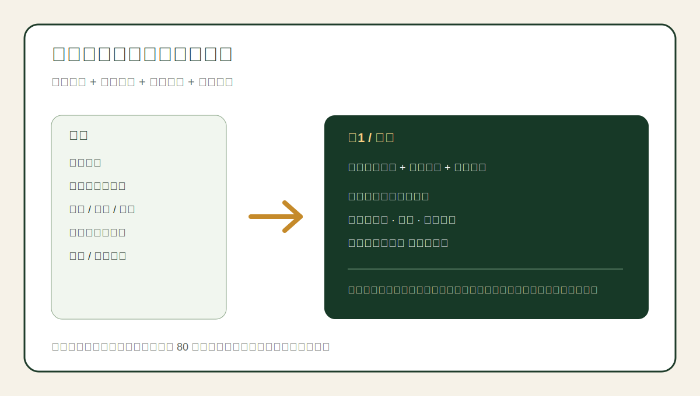

<div align="center">

# 电商视觉文案设计 Skill

> *把“想卖点”磨成设计师能直接上图、平台审核更稳的电商视觉文案执行稿。*

[](SKILL.md)
[](https://skills.sh/feichanggege/ecommerce-visual-copywriting-skill)
[](LICENSE)
[](tools/verify-skill.py)

**输入产品资料、主图初稿和资质边界，输出一套可落图的主图 + 详情页视觉文案方案：画面、图内文案、设计说明、合规自审一并交付。**

[看效果](#效果示例) · [快速开始](#快速开始) · [触发方式](#触发方式) · [能交付什么](#能交付什么) · [安全边界](#安全边界) · [验证](#验证)

</div>

---



<sub>示例基于 `examples/README.md` 的普通食品案例，展示的是本 Skill 期望产出的结构，不构成法律意见或平台审核承诺。</sub>

---

## 它解决什么问题

你让 AI 写电商文案，最常见的翻车不是“不够华丽”，而是三件事：

- 写得像详情页长文，设计师放不进主图。
- 卖点听起来猛，但碰到广告法、功效宣称或平台审核红线。
- 输出只有文案，没有画面、层级、免责声明和设计执行说明。

这个 Skill 把电商视觉文案拆成一个有门禁的 SOP：先收集产品资料和资质边界，再提炼可验证的必卖理由，用户确认后才生成主图和详情页模块。每张图只交付三样东西：**画面内容、图内文案、设计说明**。

## 效果示例

### 输入

```text
产品类型：普通食品，非保健食品，非药品
产品：松花粉固体饮料
主图初稿：突出速溶、小条便携、口感清爽
证据：暂无保健食品批准文件
平台：淘宝 / 抖音小店
```

### 输出片段

```text
[图1 / 首图]

画面：
产品盒和独立小条居中，旁边放一杯冲调后的饮品。背景用清爽绿金色，突出原料和日常饮用场景。

图内文案：
标题：松花粉固体饮料
副标题：小条装 随身带
卖点：速溶 · 清爽 · 日常饮用
声明：普通食品 非保健食品

设计说明：
主标题占视觉中心，声明放底部但保持可读。不得出现免疫、调理、改善睡眠、养生功效等暗示。
```

完整案例见 [examples/README.md](examples/README.md)。

---

## 快速开始

```bash
npx skills add feichanggege/ecommerce-visual-copywriting-skill
```

装完后，对 Agent 说：

```text
帮我把这个产品资料做成一套电商主图和详情页视觉文案方案。先提炼合规版必卖理由，等我确认后再继续出主图和详情页。
```

### 手动安装

如果你的 Agent runtime 还不支持 `npx skills add`，可以手动复制：

```bash
git clone https://github.com/feichanggege/ecommerce-visual-copywriting-skill.git
mkdir -p ~/.codex/skills/ecommerce-visual-copywriting
cp -r ecommerce-visual-copywriting-skill/SKILL.md ecommerce-visual-copywriting-skill/references ecommerce-visual-copywriting-skill/examples ~/.codex/skills/ecommerce-visual-copywriting/
```

Windows PowerShell：

```powershell
git clone https://github.com/feichanggege/ecommerce-visual-copywriting-skill.git
New-Item -ItemType Directory -Force "$env:USERPROFILE\.codex\skills\ecommerce-visual-copywriting" | Out-Null
Copy-Item -Recurse ecommerce-visual-copywriting-skill\SKILL.md,ecommerce-visual-copywriting-skill\references,ecommerce-visual-copywriting-skill\examples "$env:USERPROFILE\.codex\skills\ecommerce-visual-copywriting\"
```

---

## 触发方式

你可以这样说：

- “帮我做一套淘宝主图文案和详情页方案”
- “这段商品文案合不合规，帮我改成能上图的版本”
- “这是普通食品，不能说功效，帮我写安全版主图”
- “把这个运动器材卖点改成不医疗化的电商视觉文案”
- “先提炼必卖理由，等我确认后再写 5 张主图”
- “设计师要开工，给我画面 + 图内文案 + 设计说明”

## 能交付什么

| 场景 | 交付物 | 关键门禁 |
|---|---|---|
| 主图文案 | 5 张主图的画面、图内文案、设计说明 | 主图每张不超过 5 行 |
| 详情页 | 痛点、优势、工艺、场景、FAQ、声明等模块 | 每个模块只保留可落图信息 |
| 合规审查 | 高风险词、替换方向、免责声明 | 普通食品不写功能暗示 |
| 设计交接 | 设计师可直接执行的视觉说明 | 不输出空泛营销长文 |
| 自审评分 | 精简度、可放性、合规性、结构、实用性五维评分 | 总分低于 80 必须重写 |

## 它和普通 AI 写文案有什么不同

| 维度 | 普通 AI 文案 | 本 Skill |
|---|---|---|
| 输出形态 | 一段广告文案 | 每张图的画面 + 图内文案 + 设计说明 |
| 合规边界 | 常混用功效、绝对化、医疗化表达 | 按普通食品、保健食品、运动器材等分层检查 |
| 工作流 | 直接生成最终稿 | 必卖理由先过用户确认门 |
| 可落图 | 容易太长 | 主图/详情页都有行数上限 |
| 质量门 | 看起来顺就结束 | 自审低于 80 分必须重写 |

## 安全边界

这个 Skill 会：

- 基于用户提供的产品资料、资质、检测报告编号和平台要求写作。
- 对不确定资质标注“缺失”，不把未经验证的信息写成事实。
- 对普通食品、运动器材、保健食品使用不同合规边界。
- 在必卖理由阶段暂停，等用户确认后才继续生成主图和详情页。

这个 Skill 不会：

- 代替律师、平台小二或监管机构给出最终法律结论。
- 编造检测报告、专利号、批准文号、销量、用户评价或功效证明。
- 在用户未确认资质时宣传治疗、保健、改善身体功能等高风险卖点。
- 自动发布、上架、发送给设计师或改动店铺后台。

## 文件结构

```text
SKILL.md                         # Agent 使用的核心工作流
references/compliance-rules.md   # 分品类合规规则库和替换表
examples/README.md               # 可复用输入与输出样例
assets/showcase-output.svg       # GitHub 首页展示卡
tools/verify-skill.py            # 发布前结构和隐私检查
docs/skill-polishing-report.md   # 鲁班打磨记录和对标来源
```

## 验证

本仓库提供一个零依赖检查脚本：

```bash
python tools/verify-skill.py
```

它会检查：

- `SKILL.md` frontmatter、触发词、暂停条件和自审评分。
- README 是否包含一行安装、第一句话、效果示例、安全边界和验证说明。
- 示例、合规规则、展示卡和 marketplace 元数据是否存在。
- 仓库文本是否包含常见 token、cookie、私有路径等泄露风险。

## 适用平台

默认面向支持 Agent Skills 的运行环境，也可手动迁移到 Claude Code、Codex、OpenClaw、Cursor、Windsurf、Continue 等支持自定义指令的工具。

不同平台的加载目录可能不同；真正生效以你的 Agent runtime 文档为准。

## 致谢

这个 Skill 的打磨遵循 [Luban skill-polishing workflow](https://github.com/LearnPrompt/luban-skill) 的“验料、访行、过尺、慢刨、回炉”方法。同行对标与升级记录见 [docs/skill-polishing-report.md](docs/skill-polishing-report.md)。

## License

[MIT](LICENSE)

---

<div align="center">

*先过合规线，再谈转化率。*

</div>
