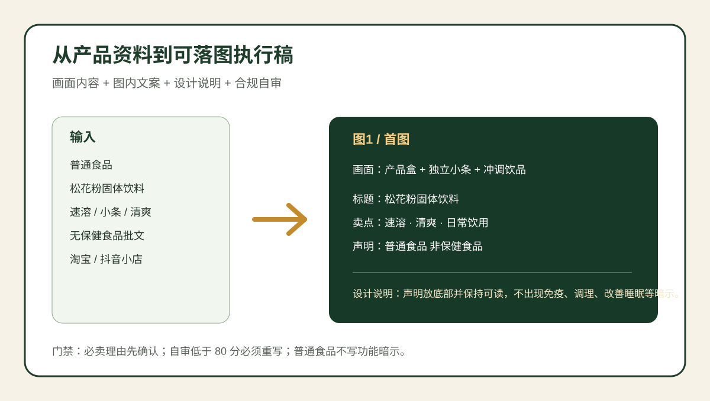
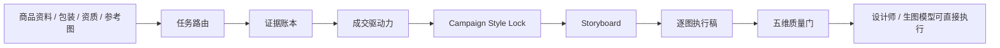

<div align="center">

# 🛒 E-commerce Visual Copywriting

### 电商视觉策划 · 主图 / 详情页 / Listing / A+ · 图内文案 · 生图 Prompt · 合规审查

**把零散商品资料，变成设计师和 AI 都能直接执行的电商视觉方案。**

[](SKILL.md)
[](SKILL.md)
[](https://skills.sh/feichanggege/ecommerce-visual-copywriting-skill)
[](LICENSE)
[](tools/verify-skill.py)

**中文** · [English](README.en.md)

[30 秒上手](#-30-秒上手) · [它解决什么](#-它解决什么) · [工作流](#-工作流) · [支持平台](#-支持平台) · [效果展示](#-效果展示) · [安全边界](#-安全边界)

</div>

<p align="center">
  
</p>

> 不是“再写一段广告文案”。它先判断**为什么用户会买**，再锁定**视觉风格与产品真实性**，建立**证据账本**，最后输出逐图可执行的画面、图内文案、设计说明和生图 Prompt。

---

## ✨ 它解决什么

普通 AI 做电商视觉，常见问题不是“不会写”，而是：

| 常见问题 | 本 Skill 的处理方式 |
|---|---|
| 直接堆卖点，5 张图说同一件事 | 每张图只解决一个购买决策问题 |
| 参数很多，但用户不知道和自己有什么关系 | `Feature → Advantage → Benefit → Evidence` |
| 参考图越改越不像原产品 | `Reference Fidelity + Negative Constraints` 锁定包装、Logo、结构、规格 |
| “写猛一点”后出现功效、绝对化、虚假证据风险 | 先建证据账本，再做宣称分级 |
| 用户只想改现有详情页，却被从零重做 | 自动进入审查/改稿模式，做最小必要修改 |
| 跨境页面只是中文直译 | 按市场、单位、场景、表达习惯做本地化重写 |
| 平台规则已经变化，AI 仍引用旧经验 | 当前规则需要时优先核验官方最新来源 |
| 输出只有文字，设计师还要二次猜 | 逐图交付画面 + 文案 + 设计说明 + Prompt + 禁止项 |

---

## 🚀 30 秒上手

### 1. 安装

```bash
npx skills add feichanggege/ecommerce-visual-copywriting-skill
```

### 2. 直接说需求

```text
这是我的产品资料、包装图和竞品参考。
面向 Amazon US，直接给我 7 张商品图 + A+ 视觉规划：
每张包含画面、英文图内文案、设计说明、生图 Prompt 和 Negative Prompt。
不要中途确认，缺失信息请标注假设，不要编造。
```

也可以更简单：

```text
帮我把这个商品做成一套能直接交给设计师的主图和详情页方案。
```

---

## 🧭 工作流


```mermaid
flowchart LR
    A[商品资料 / 包装 / 资质 / 参考图] --> B[任务路由]
    B --> C[证据账本]
    C --> D[成交驱动力]
    D --> E[Campaign Style Lock]
    E --> F[Storyboard]
    F --> G[逐图执行稿]
    G --> H[五维质量门]
    H --> I[设计师 / 生图模型可直接执行]
```

### 四种执行模式

| 模式 | 什么时候用 | 行为 |
|---|---|---|
| **标准模式** | 方向不清、成本高、用户要求先确认 | 先策略 → Storyboard → 确认后执行 |
| **一次性交付** | 用户明确“直接做完”或资料充分 | 不机械暂停，完整交付 |
| **审查 / 改稿** | 已有主图、详情页、文案、Prompt | 找问题 + 最小必要修改 |
| **设计师交接** | 需要直接开工的执行稿 | 使用固定结构输出逐图任务卡 |

### 新版 v3 核心能力

- **Evidence Ledger / 证据账本**：每条关键卖点标记“已确认 / 有依据 / 待补证 / 禁止”。
- **Reference Fidelity**：明确哪些元素必须保持、哪些可以变化。
- **Negative Prompt**：把包装变形、Logo 错误、规格变化、文字乱码、人物异常等提前写进禁止项。
- **动态图片数量**：5 张只是默认，不再为了凑数硬做 5 张。
- **多平台 Playbook**：国内电商 + Amazon / Shopify / TikTok Shop / Temu / Shopee / Lazada。
- **跨境本地化**：不是直译，重写购买理由、单位、场景和信息密度。
- **硬性阻断 + Pass/Fail 质量门**：替代无锚点的“80/100”伪精确评分。

---

## 📦 能交付什么

### 视觉策略

- 成交驱动力：视觉 / 痛点 / 参数 / 信任 / 情绪
- Top 3 购买理由
- 证据账本
- `Feature → Advantage → Benefit → Evidence`
- Campaign Style Lock
- 缺失信息、假设与风险

### Storyboard

```text
KV1  Hero      → 一眼知道卖什么 + 为什么点进来
KV2  Benefit   → 把核心参数翻译成用户收益
KV3  Proof     → 用真实证据建立信任
KV4  Scene     → 让目标用户看到自己的使用场景
KV5  Spec/CTA  → 规格、组合、选择或行动信息
```

> 实际数量按平台和商品调整，不固定 5 张。

### 单张执行卡

每张图可直接交付：

- 视觉任务
- 画面 / 构图 / 镜头 / 光影 / 背景
- 图内文案
- 第一视觉落点
- 设计说明
- 生图 Prompt
- Negative Prompt / 禁止项
- 证据来源
- 合规 / 平台备注

---

## 🌍 支持平台

| 国内 | 跨境 / DTC |
|---|---|
| 淘宝 / 天猫 | Amazon Listing / A+ / Brand Story |
| 京东 | Shopify / DTC PDP |
| 拼多多 | TikTok Shop |
| 抖音小店 | Temu |
| 其他商品详情页场景 | Shopee / Lazada |

平台相关内容分成两类处理：

1. **长期稳定的视觉策略**：使用 `references/platform-playbooks.md`。
2. **当前尺寸、主图限制、禁词、资质、审核规则**：需要时优先核验平台官方最新来源，不把旧经验写成现行规则。

---

## 🧪 典型用法

### 先策划再执行

```text
帮我做一套淘宝主图和详情页。
先判断成交驱动力、风格锁和分镜，我确认后再做最终稿。
```

### 一次性完整交付

```text
资料已经齐了，直接一次性做完，不用中途确认。
输出主图、详情页、图内文案、设计说明和生图 Prompt。
```

### 审查已有页面

```text
不要重做。帮我检查这套详情页哪里影响转化、哪里有合规风险，
按优先级给最小修改方案和修正版。
```

### 参考图保真

```text
参考这张包装图做主图。
Logo、包装颜色、规格、罐型不能变，场景和光影可以变化。
```

### 跨境本地化

```text
把这套中文详情页改成 Shopify US 英文版。
不要直译，要按美国用户的购买逻辑重写。
```

更多示例见 [examples/README.md](examples/README.md)。

---

## 🖼 效果展示

<div align="center">
  <table>
    <tr>
      <td align="center" width="50%">
        <a href="assets/showcase/musang-king-durian-main.jpg">
          
        </a><br>
        <strong>高端食品 Hero / 主图</strong>
      </td>
      <td align="center" width="50%">
        <a href="assets/showcase/figure-multi-angle.png">
          
        </a><br>
        <strong>多角度产品表达</strong>
      </td>
    </tr>
    <tr>
      <td align="center" width="50%">
        <a href="assets/showcase/figure-desktop-scene.png">
          
        </a><br>
        <strong>真实场景详情模块</strong>
      </td>
      <td align="center" width="50%">
        <a href="assets/showcase/lumina-pendant-lamp.png">
          
        </a><br>
        <strong>材质与光影表达</strong>
      </td>
    </tr>
  </table>
</div>

> 展示图用于说明视觉交付形态，不代表对应商品的法律意见、平台审核承诺或商业数据证明。

---

## 🛡 安全边界

这个 Skill **不会**：

- 编造检测报告、认证、专利、批准文号、销量、评价、排名或用户证言。
- 把“待补证”的内容写成确定事实。
- 因为用户要求“更猛”就突破医疗、食品、健康或平台合规边界。
- 用一句免责声明去“洗白”本身不允许的功效宣称。
- 把历史平台经验当成当前平台硬规则。
- 为了视觉效果擅自改错产品包装、Logo、规格或结构。

合规框架见 [references/compliance-rules.md](references/compliance-rules.md)。

---

## 🗂 仓库结构

```text
SKILL.md                          # Canonical runtime entrypoint
SKILL.en.md                       # English companion
agents/openai.yaml                # ChatGPT UI metadata
references/compliance-rules.md    # 证据与合规框架
references/platform-playbooks.md  # 多平台视觉策略
references/output-contracts.md    # 设计师交付 / 审查 / 本地化模板
examples/README.md                # 典型输入与期望行为
assets/showcase/                  # 效果展示
assets/showcase-output.svg        # 结构化输出示意
tools/verify-skill.py             # 发布前结构与隐私检查
```

---

## ✅ 验证

```bash
python tools/verify-skill.py
```

发布前建议同时使用 Skill 官方 validator / packager 检查 `SKILL.md` frontmatter 和包结构。

---

## 手动安装

macOS / Linux：

```bash
git clone https://github.com/feichanggege/ecommerce-visual-copywriting-skill.git
mkdir -p ~/.codex/skills/ecommerce-visual-copywriting
cp -r ecommerce-visual-copywriting-skill/SKILL.md \
      ecommerce-visual-copywriting-skill/SKILL.en.md \
      ecommerce-visual-copywriting-skill/agents \
      ecommerce-visual-copywriting-skill/references \
      ecommerce-visual-copywriting-skill/examples \
      ~/.codex/skills/ecommerce-visual-copywriting/
```

Windows PowerShell：

```powershell
git clone https://github.com/feichanggege/ecommerce-visual-copywriting-skill.git
New-Item -ItemType Directory -Force "$env:USERPROFILE\.codex\skills\ecommerce-visual-copywriting" | Out-Null
Copy-Item -Recurse ecommerce-visual-copywriting-skill\SKILL.md,ecommerce-visual-copywriting-skill\SKILL.en.md,ecommerce-visual-copywriting-skill\agents,ecommerce-visual-copywriting-skill\references,ecommerce-visual-copywriting-skill\examples "$env:USERPROFILE\.codex\skills\ecommerce-visual-copywriting\"
```

不同 Agent runtime 的 Skill 目录可能不同，以对应运行环境文档为准。

---

## License

[MIT](LICENSE)

<div align="center">

**先把“为什么买”讲清楚，再把每一张图做对。**

</div>
